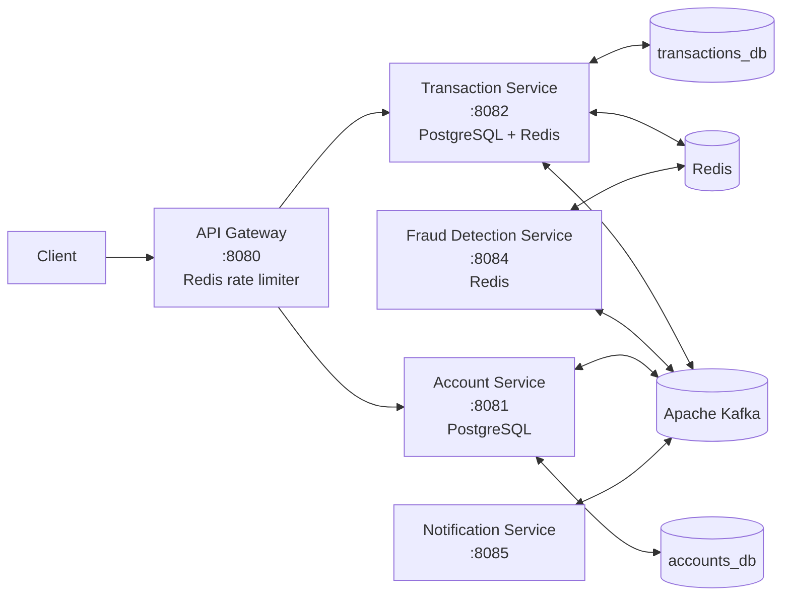
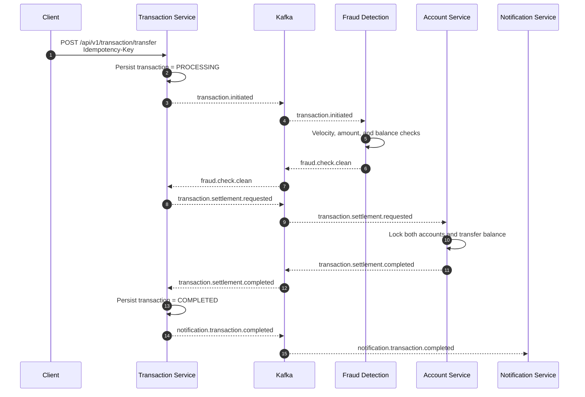
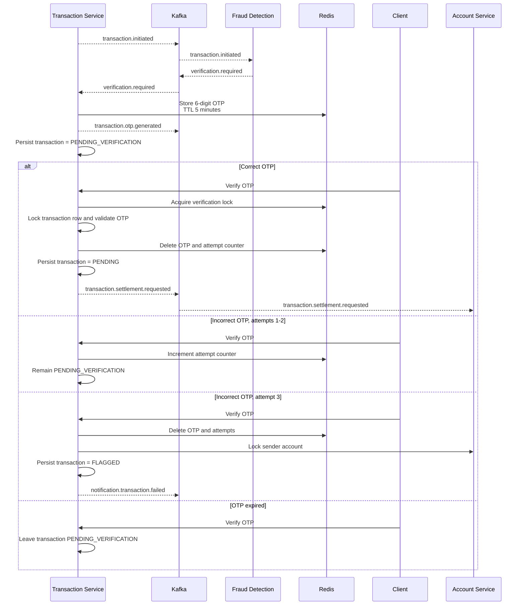
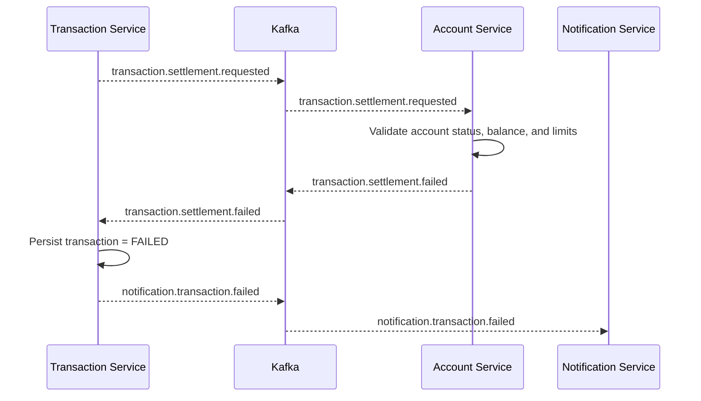

# Distributed Banking System

## Summary

Distributed Banking System is a Spring Boot microservices application for account management and event-driven money transfers. The system uses Kafka to coordinate a transfer saga, PostgreSQL for durable service-owned data, Redis for distributed coordination and fraud/OTP state, and Spring Cloud Gateway for API routing and rate limiting.

The implemented transfer flow is:

```text
Client -> API Gateway -> Transaction Service
                         -> Fraud Detection Service
                         -> Account Service
                         -> Notification Service
```

## System design



Kafka event contracts are shared as immutable Java records in `banking-common`.

## Transactional flow

### Success flow



Implemented state sequence:

```text
PROCESSING
  -> transaction.initiated
  -> fraud.check.clean
  -> PENDING
  -> transaction.settlement.requested
  -> transaction.settlement.completed
  -> COMPLETED
```

### Fraud and OTP verification flow

Suspicious activity does not proceed directly to settlement. Fraud Detection publishes `verification.required`, and Transaction Service requires OTP verification.



Implemented state sequence:

```text
PROCESSING
  -> verification.required
  -> transaction.otp.generated
  -> PENDING_VERIFICATION

PENDING_VERIFICATION
  -> [correct OTP] PENDING
  -> [three incorrect attempts] FLAGGED
```

### Settlement failure flow



Implemented state sequence:

```text
PROCESSING
  -> PENDING
  -> transaction.settlement.requested
  -> transaction.settlement.failed
  -> FAILED
```

Settlement failures mark the transaction as `FAILED` and publish `notification.transaction.failed`, which is consumed by Notification Service. OTP lockout failures follow the same notification path; the event includes the transaction, sender, receiver, amount, title, and failure reason. Successful settlement publishes `notification.transaction.completed`, and Notification Service logs debit and credit alerts for both accounts.

### Kafka event/state matrix

| Kafka topic/event | Producer | Consumer | Result |
|---|---|---|---|
| `transaction.initiated` | Transaction Service | Fraud Detection Service | Starts fraud evaluation |
| `verification.required` | Fraud Detection Service; Transaction Service for OTP renewal | Transaction Service | Generates OTP and moves transaction to `PENDING_VERIFICATION` |
| `transaction.otp.generated` | Transaction Service | No consumer currently implemented | Represents OTP generation |
| `fraud.check.clean` | Fraud Detection Service | Transaction Service | Starts settlement request |
| `transaction.settlement.requested` | Transaction Service | Account Service | Starts account balance settlement; transaction is `PENDING` before publication |
| `transaction.settlement.completed` | Account Service | Transaction Service | Moves transaction to `COMPLETED` |
| `transaction.settlement.failed` | Account Service | Transaction Service | Moves transaction to `FAILED` |
| `notification.transaction.completed` | Transaction Service | Notification Service | Logs debit/credit notifications |
| `notification.transaction.failed` | Transaction Service for settlement failures and OTP lockouts | Notification Service | Logs failure notification |
`PENDING` is used while a settlement request is in flight. `FLAGGED` is used when OTP verification reaches the lockout threshold because suspicious activity was detected. A refund/compensation consumer is not implemented.

## Concurrency and idempotency

### Transfer request idempotency

- Transfer initiation requires an `Idempotency-Key` header.
- The key is stored in a database table with a uniqueness constraint.
- The claim uses atomic `INSERT ... ON CONFLICT DO NOTHING`, avoiding a check-then-insert race.
- If concurrent requests use the same key, one request wins and the other returns the winning transaction.
- Generated transaction reference collisions are retried up to three times.

### Account creation idempotency

- Account creation uses the same atomic idempotency-claim pattern.
- Account number generation is retried up to three times when a unique constraint collision occurs.

### Safe concurrent balance transfers

- Account settlement runs in a database transaction with a ten-second timeout.
- Sender and receiver rows are acquired with pessimistic write locks.
- Accounts are locked in sorted account-number order, preventing opposite-direction transfers from taking locks in inconsistent order and reducing deadlock risk.
- Balance, account status, and daily transaction-limit checks happen while the rows are locked.

### Duplicate Kafka settlement protection

- Account Service claims a transaction in `settlement_records` before moving money.
- `transaction_id` is unique and the claim uses `ON CONFLICT DO NOTHING`.
- A replayed `transaction.settlement.requested` event therefore cannot debit and credit the accounts twice.

### OTP verification concurrency

- Verification takes a Redis distributed lock at `verification:lock:{transactionId}` with a 30-second TTL.
- It also locks the transaction row in PostgreSQL.
- The OTP is deleted after successful verification, making the operation single-use.
- OTPs expire after five minutes and invalid attempts are tracked in Redis.
- The third incorrect attempt locks the sender account and fails the transaction.

### Transaction state guards

Transaction Service ignores settlement results for transactions already in terminal `COMPLETED` or `FAILED` states, protecting state from stale or duplicate completion/failure events.

## Additional implemented strengths

- API Gateway rate limiting uses Redis with a replenish rate of 10 requests and burst capacity of 20 per client IP.
- Jakarta Bean Validation protects transfer input such as required accounts and positive amounts.
- Domain-specific exceptions and global exception handlers provide consistent API errors.
- Kafka event payloads are centralized in `banking-common` and represented as immutable Java records.
- Docker Compose includes PostgreSQL, Redis, and Kafka health checks and starts dependent services only after infrastructure is healthy.
- Fraud detection combines velocity, amount-anomaly, and sender-balance-percentage rules using Redis-backed state.
